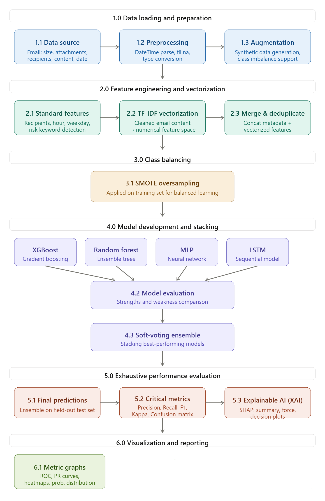
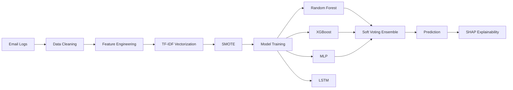
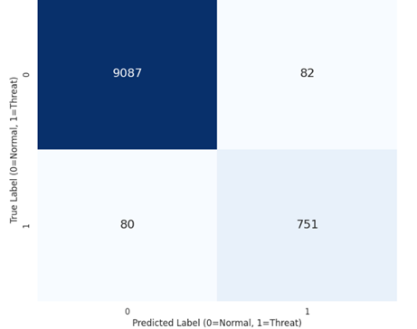
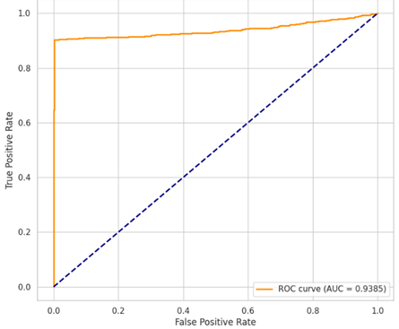
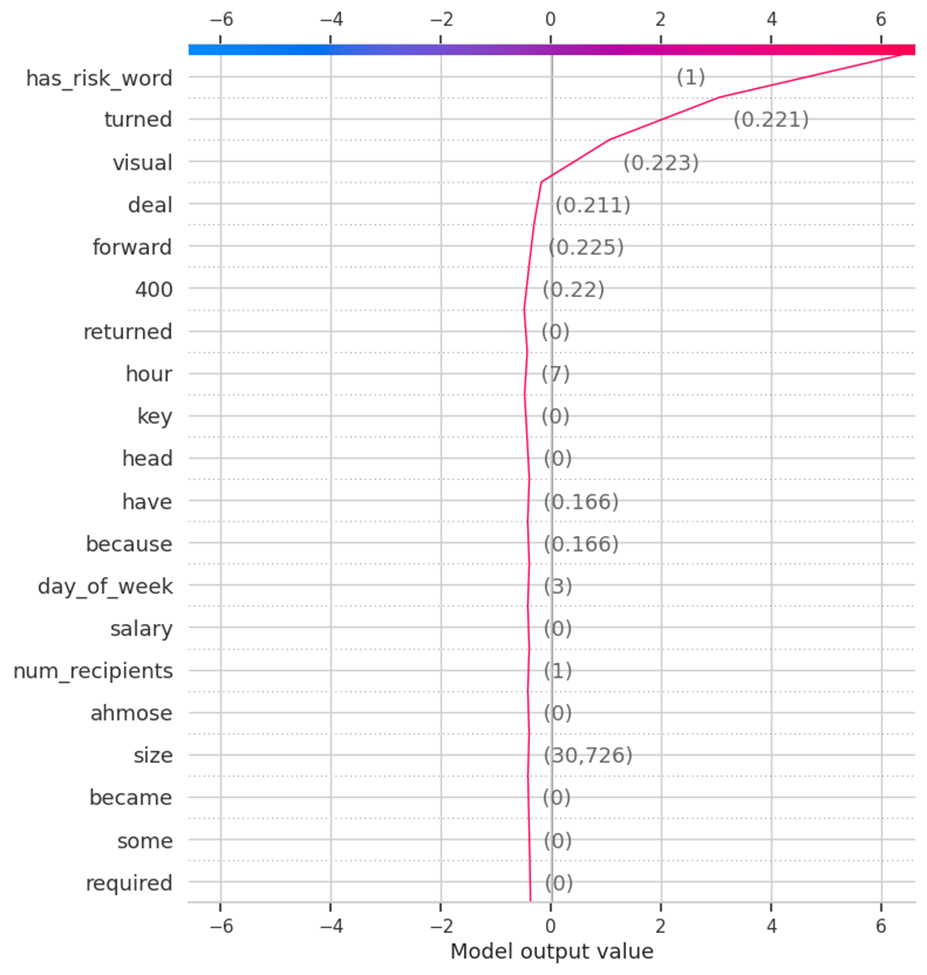
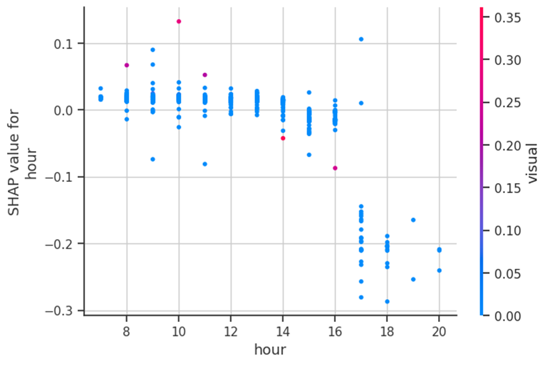
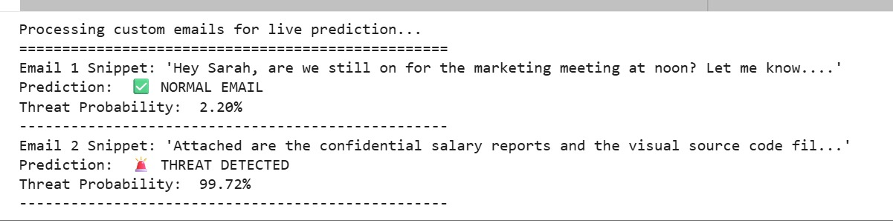

<div align="center">

# 🛡️ Insider Threat Detection using Explainable AI

### Explainable machine learning framework for detecting insider threats from enterprise email logs using behavioral analytics, ensemble learning, and SHAP.


</div>

---

## 📌 Overview

Insider threats are among the hardest cybersecurity risks to detect because malicious employee activity often resembles normal organizational behavior.

This project presents an **Explainable AI (XAI)** pipeline that combines **behavioral feature engineering**, **TF-IDF text vectorization**, **ensemble learning**, and **SHAP explainability** to identify suspicious email activity while providing transparent model predictions.

---

## ✨ Key Features

- 📧 TF-IDF based email content analysis
- 👤 Behavioral feature engineering
- ⚖️ SMOTE for class imbalance handling
- 🌲 Random Forest
- ⚡ XGBoost
- 🧠 Multi-Layer Perceptron (MLP)
- 🔄 LSTM Neural Network
- 🤝 Soft Voting Ensemble
- 🔍 SHAP Explainability
- 📊 Model evaluation using ROC Curve and Confusion Matrix

---

## 🏗️ System Architecture

<p align="center">

</p>

The framework processes enterprise email records, extracts meaningful behavioral and textual features, trains multiple machine learning models, combines their predictions using a Soft Voting Ensemble, and explains predictions with SHAP.

---

## ⚙️ Machine Learning Pipeline



---

## 🛠️ Technology Stack

| Category | Tools |
|-----------|-------|
| Language | Python |
| Data Processing | Pandas, NumPy |
| Machine Learning | Scikit-Learn, XGBoost |
| Deep Learning | TensorFlow, Keras |
| Explainability | SHAP |
| Visualization | Matplotlib |

---

## 📂 Dataset

This project uses the **CERT Insider Threat Email Dataset**.

> **Note**
>
> The dataset is **not included** in this repository.
>
> Download the dataset separately and place **`email.csv`** in the project root before running the notebook.

---

## 📈 Model Performance

The final prediction is generated using a **Soft Voting Ensemble** that combines the strengths of multiple models.

Evaluation metrics include:

- Accuracy
- Precision
- Recall
- F1 Score
- Cohen's Kappa
- ROC Curve
- Confusion Matrix

<p align="center">


</p>

---

## 🔍 Explainable AI with SHAP

Unlike traditional black-box models, this project integrates **SHAP (SHapley Additive Explanations)** to explain every prediction.

SHAP highlights which features increase or decrease the probability of an email being classified as malicious, making the model more transparent and suitable for cybersecurity analysis.

<p align="center">

</p>

### Feature Importance

<p align="center">

</p>

---

## 💻 Sample Prediction

Example prediction generated by the notebook.

<p align="center">

</p>

---

## 📁 Repository Structure

```text
insider-threat-detection-xai
│
├── images/
│   ├── architecture_diagram.png
│   ├── prediction_demo.png
│   ├── shap_force_plot.png
│   ├── shap_hour_dependence.png
│   ├── voting_confusion_matrix.png
│   └── voting_roc_curve.png
│
├── notebooks/
│   └── insider_threat_detection.ipynb
│
├── README.md
├── requirements.txt
└── .gitignore
```

---

## 🚀 Installation

Clone the repository

```bash
git clone https://github.com/supriyabaghel/insider-threat-detection-xai.git
```

Move into the project directory

```bash
cd insider-threat-detection-xai
```

Install dependencies

```bash
pip install -r requirements.txt
```

Download the CERT Insider Threat dataset and place **`email.csv`** in the project root.

Launch Jupyter Notebook

```bash
jupyter notebook
```

Open

```text
notebooks/insider_threat_detection.ipynb
```

Run all cells.

---

## 🚀 Future Improvements

- Real-time threat monitoring
- Transformer-based NLP models (BERT)
- Streaming log analytics
- Interactive dashboard
- Docker deployment
- FastAPI inference API

---

## 👩‍💻 Author

**Supriya Baghel**

Computer Science Engineering • Machine Learning • Data Analytics • Cybersecurity

GitHub: https://github.com/supriyabaghel

---

## 📜 License

This project is licensed under the MIT License.

---

<div align="center">

### ⭐ If you found this project useful, consider giving it a Star!

</div>